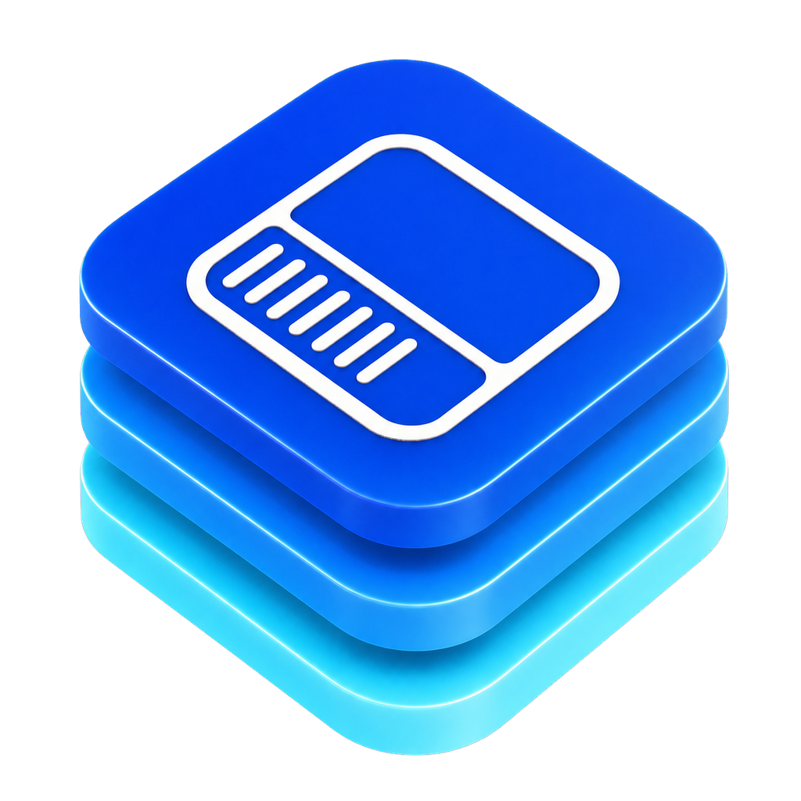

#  ResponsiveLayoutKit

Size-class-driven responsive layout for SwiftUI. Write your UI once and supply phone- or tablet-specific layouts only where they differ. Each decision can react to the local container or to the window scene.


## Why

SwiftUI's built-in `\.horizontalSizeClass` is container-local: inside a sheet on iPad it reports `.compact` even though the window is regular-width. That's usually what you want. Sometimes it isn't, and you need the scene's truth instead: the environment the window is in, regardless of the sheet, column, or popover you happen to be rendered in.

ResponsiveLayoutKit models both explicitly with one vocabulary:

| `LayoutContext` | Answers | Backed by |
|---|---|---|
| `.container` (default) | "How much room does this view have?" | SwiftUI's native size classes, zero setup |
| `.scene` | "What environment is my window in?" | Per-scene observation of `UIWindowScene` |

Every window gets its own scene truth, so iPadOS Stage Manager windows with different sizes each resolve correctly. Nothing is shared through a singleton.

## Requirements

- iOS 26.0+
- Swift 6.2+ / Xcode 26+

## Installation

Add via Swift Package Manager:

```swift
dependencies: [
    .package(url: "https://github.com/KalebCooper/ResponsiveLayoutKit.git", from: "0.3.0")
]
```

Or in Xcode: **File ▸ Add Package Dependencies…** and paste the repository URL.

## Quick start

### Adapt one view per layout (identity-stable)

```swift
import ResponsiveLayoutKit

ContentList()
    .responsive { content, layout in
        content
            .listStyle(layout == .tablet ? .insetGrouped : .plain)
            .padding(layout.value(phone: 8, tablet: 24))
    }
```

The closure receives the resolved `ResponsiveLayout` as a value, the same shape as `scrollTransition` and `visualEffect`. Crossing a size-class threshold (rotating, or resizing in Stage Manager) changes parameters rather than view structure, so `@State`, scroll positions, and running tasks all survive.

### Swap whole hierarchies explicitly

```swift
ResponsiveView {
    PhoneTabBar()
} tablet: {
    TabletSplitView()
}
```

`ResponsiveView` is the one API that swaps subtrees on a layout change (and its two-builder shape says so). Keep state that must survive the swap above it or in an observable model.

### Read the layout as a value

```swift
@Environment(\.responsiveLayout) private var layout          // override → scene → container → phone
@Environment(\.containerResponsiveLayout) private var local  // override → container → phone

private var sheetEdge: SheetEdge {
    layout.value(phone: .bottom, tablet: .leading)
}
```

When the family feeds computed properties, view arguments, or pure functions — not view decoration — read it straight from the environment. Same canonical resolution order as every other API, identity-stable, honors `.responsiveLayout(_:)` overrides.

### Cap content to a readable width

```swift
ScrollView {
    SettingsContent()
        .responsiveContentWidth()   // 66% of the scene width on tablet, centered; full-width on phone
}
```

The analogue of UIKit's `readableContentGuide`. Apply to the content inside the `ScrollView` — the scroll surface stays edge-to-edge. Reads the scene (window) width, so Split View and Stage Manager panes inset relative to their own window; pass `tabletFraction:` to tune.

### Resolve against the window, not the container

```swift
// In a compact-width sheet on iPad: .container → phone, .scene → tablet.
ResponsiveView(in: .scene) {
    CompactChrome()
} tablet: {
    RegularChrome()
}
```

Install an anchor once per scene root so every descendant, including sheets, resolves from a single probe:

```swift
WindowGroup {
    RootView()
        .sceneLayoutAnchor()
}
```

Views using `.scene` self-discover when no anchor exists, though the first frame falls back to the container size class until discovery completes. Read scene truth directly anywhere:

```swift
@Environment(\.sceneLayout) private var sceneLayout
// sceneLayout?.horizontalSizeClass, .size, .interfaceOrientation, .safeAreaInsets,
// .responsiveLayout, .isLandscapeAspectRatio (width > height — not the same as orientation)
```

### Force a layout (previews and tests)

```swift
MyScreen()
    .responsiveLayout(.tablet)
```

When code also reads scene *size*, mock the whole scene instead — every scene-truth read (family, size, orientation, safe area) resolves against the declared values, so tablet previews are truthful on any canvas:

```swift
#Preview("Tablet, landscape window") {
    MyScreen()
        .sceneLayout(mocking: SceneLayoutMockValues(
            size: CGSize(width: 1210, height: 856),
            horizontalSizeClass: .regular
        ))
}
```

### Accessibility-driven scrolling

```swift
SettingsForm()
    .accessibilityScrollView(.threshold())   // scrolls past .accessibility1 Dynamic Type or short windows
Dashboard()
    .accessibilityScrollView(.automatic)     // scrolls only when content overflows
```

Content lives in a single always-present `ScrollView` whose scrolling toggles on and off; it's never a structural swap. A Dynamic Type change mid-session won't wipe a half-filled form's state, and `Spacer`-based layouts keep their shape while scrolling is inactive.

Greedy children (aspect-ratio images, `Map`) would otherwise make the fit test overflow permanently — give them a compressible floor so they shrink first and scrolling engages only when even the floored layout can't fit:

```swift
Image(.hero)
    .resizable()
    .aspectRatio(1.6, contentMode: .fit)
    .accessibilityScrollFloor(150)   // compress to 150pt before scrolling engages
```

## View identity guarantees

The kit follows one rule: **identity behavior is visible in an API's shape.**

- Everything modifier-shaped (`.responsive { }`, `.responsiveLayout()`, `.responsiveContentWidth()`, `.accessibilityScrollView()`, `.accessibilityScrollFloor()`, `.sceneLayoutAnchor()`, `.sceneLayout(mocking:)`) and every environment read (`\.responsiveLayout`, `\.containerResponsiveLayout`, `\.sceneLayout`) is guaranteed identity-stable across layout changes.
- The one API that swaps subtrees, `ResponsiveView { } tablet: { }`, declares it by taking two builders.

## Demo app

A runnable demo app in [`Demo/`](Demo/) exercises every API live: scene readouts, container-vs-scene in a sheet, identity survival, and accessibility scrolling. It's a standalone Xcode app that references this package as a local dependency, so it's never part of any product. Consumers of the library never build or link it, and it isn't shipped via SwiftPM.

SwiftPM can't build an iOS `.app`, so the demo needs a real Xcode app target. The project file is generated from [`Demo/project.yml`](Demo/project.yml) with [XcodeGen](https://github.com/yonaskolb/XcodeGen) rather than checked in. Generate and open it:

```bash
# One-time: install XcodeGen (https://github.com/yonaskolb/XcodeGen)
brew install xcodegen

# From the repo root:
cd Demo
xcodegen generate
open ResponsiveLayoutKitDemo.xcodeproj
```

Then pick an iPhone or iPad simulator and hit **Run** (⌘R). Re-run `xcodegen generate` any time `project.yml` or the source layout changes.

## Claude Code skill

This repo doubles as a [Claude Code](https://code.claude.com) plugin marketplace. If you build with Claude Code, install the bundled skill so the agent knows ResponsiveLayoutKit's APIs and identity semantics when writing code against the library:

```bash
/plugin marketplace add KalebCooper/ResponsiveLayoutKit
/plugin install responsivelayoutkit@cooperlabs
```

The skill loads on demand when you work on responsive-layout code; no configuration needed. Pull newer versions later with `/plugin marketplace update`. Source lives in [`plugins/responsivelayoutkit/`](plugins/responsivelayoutkit/).

## Documentation

All public symbols carry DocC comments. Build docs locally with **Product ▸ Build Documentation** in Xcode.

## License

MIT. See [LICENSE](LICENSE).
